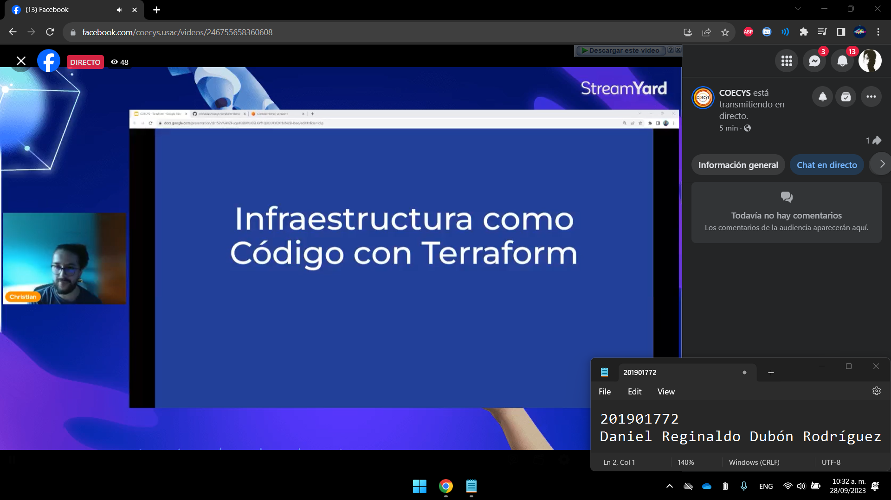
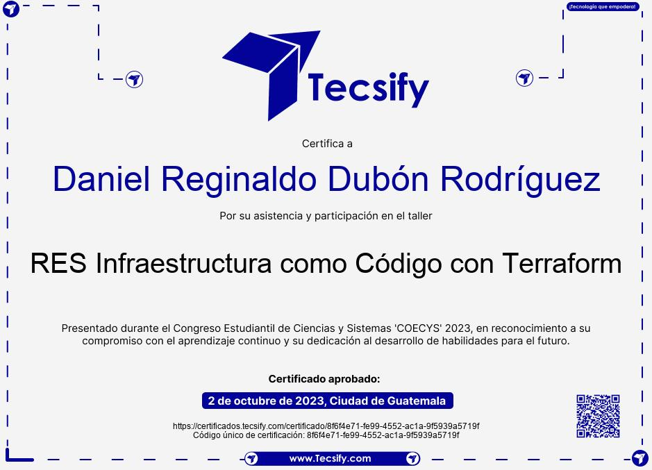

***201901772 - Daniel Reginaldo Dubón Rodríguez***

# 👨‍💻 Infraestructura como código de Terraform

Es un enfoque en la gestión y aprovisionamiento de recursos de infraestructura de TI utilizando cödigo y automatizaciön en lugar de configuraciones manuales.

En lugar de configurar servidores, redes y otros componentes de infraestructura de forma manual, se definen scripts o definiciones de código que describen la configuración deseada. Estos scripts se pueden utilizar para crear, modificar y eliminar recursos de infraestructura de manera consistente y reproducible.

La abstracción de la infraestructura como código es una gran ventaja ya que permite automatizar la creación de recursos de infraestructura y administrarlos de manera eficiente. Además, el código de infraestructura se puede almacenar en un sistema de control de versiones, lo que permite a los equipos colaborar en el desarrollo de infraestructura y realizar un seguimiento de los cambios a lo largo del tiempo.

Ahora terraform es una herramienta de código abierto desarrollada por HashiCorp que permite definir y aprovisionar una infraestructura de centro de datos mediante un lenguaje de configuración de alto nivel conocido como Hashicorp Configuration Language (HCL), o utilizando el formato JSON.

Muchos proveedores de nube admiten Terraform, lo que permite administrar una variedad de servicios de infraestructura en la nube, incluidos servidores, balanceadores de carga, redes y servicios de almacenamiento, entre otros. Algunos proveedores que cuentan con soporte para Terraform incluyen AWS, Microsoft Azure, Google Cloud Platform, DigitalOcean y Oracle Cloud Infrastructure.

Terraform tiene una curva de aprendizaje relativamente baja y es fácil de usar. El código de infraestructura se puede escribir en un editor de texto simple y se puede ejecutar desde la línea de comandos. Terraform también es compatible con la integración continua y la entrega continua (CI / CD), lo que permite a los equipos automatizar la creación y administración de infraestructura.

Los beneficios que nos provee al utilizar este tipo de abstracción y herramientas son:

- **Automatización:** permite automatizar la creación de infraestructura y administrarla de manera eficiente.

- **Consistencia:**  permite crear y administrar infraestructura de manera consistente y reproducible. El código de infraestructura se puede compartir entre equipos, lo que garantiza que todos los recursos se creen de la misma manera.

- **Colaboración:** permite a los equipos colaborar en el desarrollo de infraestructura. El código de infraestructura se puede almacenar en un sistema de control de versiones, lo que permite a los equipos colaborar.

- **Seguridad:** permite aplicar las mejores prácticas de seguridad y cumplimiento de manera consistente y reproducible.

## Conclusiones

- Facilita el despliegue de infraestructura en la nube, ya que se puede automatizar el proceso de creación de recursos.
- Permite el control e integracion continua de la infraestructura, lo que nos permite la colaboración en la creación de la infraestructura.
- Es util para la creación de ambientes de desarrollo, pruebas y producción, esto aplica tanto para la vida laboral como para la vida academica.

## Incio

## Final

## Certificado

