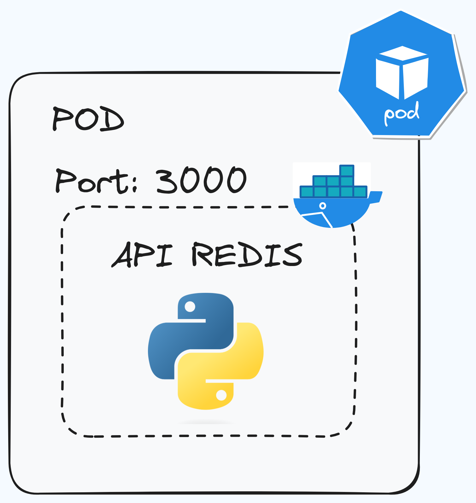
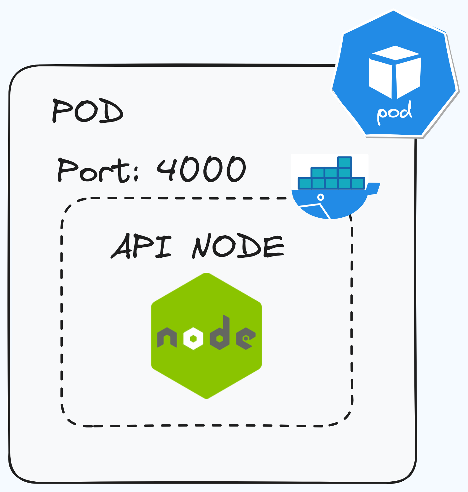
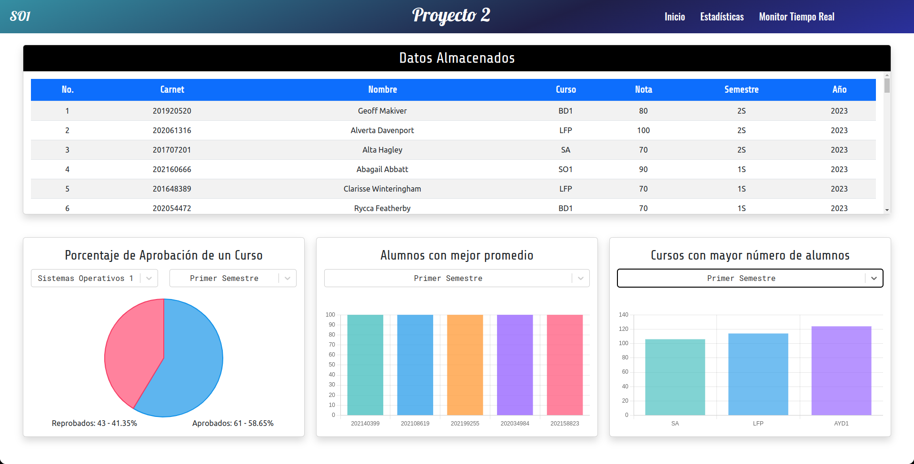
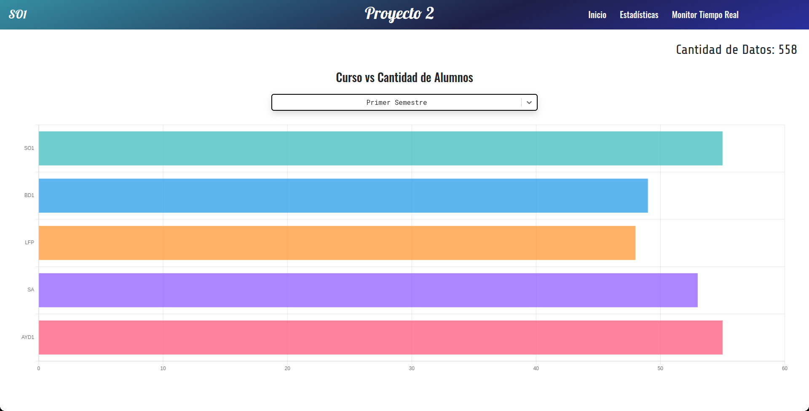

# 📑 MANUAL TÉCNICO [SO1]P2_201901772

```bash
Universidad de San Carlos de Guatemala
Facultad de Ingeniería
Escuela de Ciencias y Sistemas
Laboratorio Sistemas de Bases de Datos 1
Ing. Jesus Guzman Polanco
Aux. José DANIEL Velásquez Orozco
Aux. Jhonathan Daniel Tocay

Carné: 201901772
Nombre: Daniel Reginaldo Dubón Rodríguez
```
# Sistema de Registro de Notas

El objetivo de este proyecto es evaluar y mejorar el rendimiento de un sistema de ingreso de
notas en línea mediante pruebas de carga y rendimiento utilizando Locust, Kubernetes y
servicios en la nube como Cloud SQL y Cloud run. El sistema permite a los profesores o
administradores académicos ingresar y gestionar las calificaciones de los estudiantes de
manera eficiente. Además se debe de implementar una Aplicación web donde se muestre
las estadísticas y reportes de las notas de los estudiantes.

## Arquitectura

<div align="center"></div>

## Generador de tráfico

<div align="center"></div>

***Tecnologías Utilizadas:*** Lenguaje de Programación Python, Locust

Herramienta que permite simular el tráfico de usuarios en el sistema de registro de notas. Esta herramienta permite simular el tráfico de usuarios en el sistema de registro de notas, para esto se usa el lenguaje de programación Python y la librería Locust, la cual permite la simulación de tráfico de usuarios en el sistema de registro de notas el codigo de este generador de trafico se encuentra en el siguiente repositorio: [`Generador de Trafico`](../locust)

El formato de los datos que se envian al sistema de registro de notas es el siguiente:

```json
{
    "carnet": 201901772,
    "nombre": "Daniel Reginaldo Dubon Rodriguez",
    "curso": "SO1",
    "nota": 100,
    "semestre": "2S",
    "year": 2023
}
```

Los Cursos a Monitorear pueden ser:

- **SO1** - Sistemas Operativos 1
- **BD1** - Sistemas de Bases de Datos 1
- **LFP** - Lenguajes Formales y de Programación
- **SA** - Software Avanzado● AYD1 - Análisis y Diseño 1

La descripción para semestre puede se:
- **1S** - Primer Semestre.
- **2S** - Segundo Semestre.
**Año**: 2023
**Nota**: 50, 60, 70, 80, 90, 100.

El endopoint para el envio de datos es el siguiente:

| EndPoint | Método HTTP | Descripción |
| ------ | :------: | ------ |
| `/set/nota` | `POST` | Envia los datos de la nota de un estudiante |

## Kubernetes

<div align="center"></div>

***Tecnologías Utilizadas:*** Kubernetes, Google Cloud Platform

Kubernetes se encarga de la orquestación de los contenedores de Docker que se encuentran en la nube de Google Cloud Platform. Para esto se creo un archivo llamado deployment.yaml el cual contiene la configuración de los contenedores a ejecutar. A continuación se estaran explicando las diferentes diferentes aplicaciones de la arquitectura.

Para Kubernetes se utilizo el servicio de Google Cloud Platform llamado Google Kubernetes Engine (GKE) el cual permite la creación de un cluster de Kubernetes en la nube de Google Cloud Platform.

Para la creación del cluster de Kubernetes se utilizo el siguiente comando:

```bash
gcloud container clusters create so1p2 --num-nodes=3 --zone=us-central1-a
```

- ### Namespace

    Se creo un namespace llamado `so1p2` el cual contiene todos los recursos de la arquitectura.

    [`so1p2`](../k8s/namespaces/so1p2.yml)

    Tambien se creo un namespace para el ingress controller llamado `ingress-nginx` el cual contiene todos los recursos del ingress controller.

    [`ingress-nginx`](../k8s/namespaces/ngnix-ingress.yml)

    Para poder ejecutar los namespaces se debe de ejecutar el siguiente comando:

    ```bash
    kubectl apply -f <nombre_namespace>.yml
    ```

    Para poder eliminar los namespaces se debe de ejecutar el siguiente comando:

    ```bash
    kubectl delete -f <nombre_namespace>.yml
    ```


- ### Ingress

    <div align="center"></div>

    El ingress se encarga de gestionar el acceso externo a los servicios dentro del clúster. Actúa como una puerta de entrada que posibilita la exposición de servicios HTTP y HTTPS fuera del clúster. Tambien se encarga de distribuir de manera equitativa el tráfico de datos. En otras palabras, la configuración del tráfico será del 50% para la ruta 1 (gRCP Golang) y del 50% para la ruta 2 (API REDIS).

    Para poder hacer el traffic split se hizo uso de un ingress controller de nginx el cual se encarga de gestionar el acceso externo a los servicios dentro del clúster. 
    
    Para esto se tuvo que instalar el ingress controller de nginx en el cluster de kubernetes.

    ***Instalación del Ingress Controller***

    ```bash
    # Crear el namespace para el ingress controller
    kubectl create namespace ingress-nginx

    # Agregar el repositorio de Helm
    helm repo add ingress-nginx https://kubernetes.github.io/ingress-nginx

    # Actualizar el repositorio de Helm
    helm repo update

    # Instalar el ingress controller de nginx
    helm install nginx-ingress ingress-nginx/ingress-nginx -n nginx-ingress

    # Verificar que el ingress controller se haya instalado correctamente
    kubectl get services -n nginx-ingress
    ```

    ***Configuración del Ingress Controller***

    [`Archivo de configuraición del ingress`](../k8s/ingress/ingress.yml)

    Para poder ejecutar el ingress se debe de ejecutar el siguiente comando:

    ```bash
    kubectl apply -f ngnix-ingress.yml
    ```

    Para poder eliminar el ingress controller se debe de ejecutar el siguiente comando:

    ```bash
    kubectl delete -f ngnix-ingress.yml
    ```
  
- ### Rutas
  - **Ruta 1 gRPC Golang**

    <div align="center"></div>
    
    Esta ruta esta desarrollada en el lenguaje de progamación Golang y se compone de dos servicios:

    - [`Servicio 1 gRPC client`](../backend/ruta-go/client)

        Este servicio se encarga de recibir las peticiones de los usuarios y enviarlas al servicio 2 gRPC server.
    
    Su imagen de Docker se encuentra en el siguiente repositorio: [`grpc_client`](https://hub.docker.com/repository/docker/daniel499/grpc_client/)

    - [`Servicio 2 gRPC server`](../backend/ruta-go/server)

        Este servicio se encarga de recibir las peticiones del servicio 1 gRPC client, procesarlas y guardarlas en la base de datos Cloud SQL.
    
    Su imagen de Docker se encuentra en el siguiente repositorio: [`grpc_server`](https://hub.docker.com/repository/docker/daniel499/grpc_server)

    Estos dos servicios se encuentran en el mismo deployment y se ejecutan en el mismo pod:

    - [`Archivo de configuraición del deployment`](../k8s/deployments/grpc-app.yml)
    - [`Archivo de configuraición del servicio`](../k8s/services/grpc-app.yml)


    - **Ruta 2 API REDIS**

        <div align="center"></div>
        
        Este servicio esta desarrollado en el lenguaje de progamación Python y se encarga de recibir las peticiones de los usuarios, procesarlas y guardarlas en una base de datos REDIS y en una base de datos Cloud SQL.

        Su imagen de Docker se encuentra en el siguiente repositorio: [`api_redis`](https://hub.docker.com/repository/docker/daniel499/api_python)

        - [`Archivo de configuraición del deployment`](../k8s/deployments/python-app.yml)
        - [`Archivo de configuraición del servicio`](../k8s/services/python-svc.yml)

- ### REDIS

  <div align="center"></div>
  
  Se utilizo una base de datos Redis para almacenar los datos de los estudiantes que pasan por la ruta 2. Con la finalidad de poder comparar el rendimiento de la base de datos Cloud SQL con la base de datos Redis.

  - [`Archivo de configuraición del deployment`](../k8s/deployments/redis.yml)
  - [`Archivo de configuraición del servicio`](../k8s/services/redis-svc.yml)

- ### API NODE

    <div align="center"></div>

    Esta API esta desarrollada en el lenguaje de progamación NodeJS y se encarga de disponer una serie de endpoints para poder obtener las estadisticas de las notas de los estudiantes consumidas por la aplicación web. Esta hace uso de la base de datos Cloud SQL y la de REDIS para obtener los datos de los estudiantes y hace uso de websockets para poder enviar los datos a la aplicación web en tiempo real.

    | EndPoint | Método HTTP | Descripción |
    | ------ | :------: | ------ |
    | `/ping` | `GET` | Verifica que existe conexión con la API |
    | `/connection` | `GET` | Verifica que existe conexión con la base de datos |
    | `/estdisticas/registros` | `GET` | Obtiene todas las notas de los estudiantes |
    | `/estdisticas/promedios/:semestre` | `GET` | Obtiene el promedio de las notas de los estudiantes por semestre |
    | `/estdisticas/alumnos/:semestre` | `GET` | Obtiene la cantidad de alumnos por semestre |
    | `/estdisticas/aprobacion/:semestre/:curso` | `GET` | Obtiene el porcentaje de aprobación de un curso por semestre |

- ### HPA (Horizontal Pod Autoscaling)

    El HPA ajusta automáticamente la cantidad de PODS en ejecución en un despliegue o conjunto de réplicas según la utilización de la CPU u otras métricas. Para el Proyecto 2, cada Pod debe tener un mínimo de 1 réplica y un máximo de 3 réplicas. Además, se debe configurar que el uso de la CPU no exceda el 50% de la capacidad del Pod.

    - [`Archivo de configuraición del HPA de la ruta 1`](../k8s/hpa/grpc-hpa.yml)
    - [`Archivo de configuraición del HPA de la ruta 2`](../k8s/hpa/python-hpa.yml)
    - [`Archivo de configuraición del HPA de REDIS`](../k8s/hpa/redis-hpa.yml)
    - [`Archivo de configuraición del HPA de la API NODE`](../k8s/hpa/node-hpa.yml)

- ### Comandos básicos de Kubernetes

    - **Obtener los pods**

        ```bash
        kubectl get pods -n <nombre_namespace>
        ```

    - **Obtener los servicios**

        ```bash
        kubectl get services -n <nombre_namespace>
        ```

    - **Obtener los deployments**

        ```bash
        kubectl get deployments -n <nombre_namespace>
        ```

    - **Obtener los HPA**

        ```bash
        kubectl get hpa -n <nombre_namespace>
        ```

    - **Obtener los ingress**

        ```bash
        kubectl get ingress -n <nombre_namespace>
        ```

    - **Obtener los namespaces**

        ```bash
        kubectl get namespaces
        ```

    - **Obtener los logs de un pod**

        ```bash
        kubectl logs <nombre_pod> -n <nombre_namespace>
        ```

    - **Obtener los eventos del cluster**

        ```bash
        kubectl get events -n <nombre_namespace>
        ```

    - **Obtener los recursos del cluster**

        ```bash
        kubectl top nodes -n <nombre_namespace>
        ```

    - **Obtener los recursos de un pod**

        ```bash
        kubectl top pods -n <nombre_namespace>
        ```

    - **Obtener los recursos de un deployment**

        ```bash
        kubectl top deployments -n <nombre_namespace>
        ```

    - **Obtener los recursos de un HPA**

        ```bash
        kubectl top hpa -n <nombre_namespace>
        ```

    - **Obtener los recursos de un servicio**

        ```bash
        kubectl top services -n <nombre_namespace>
        ```

    - **Obtener los recursos de un ingress**

        ```bash
        kubectl top ingress -n <nombre_namespace>
        ```

## Cloud SQL

<div align="center"></div>

***Tecnologías Utilizadas:*** Google Cloud Platform, Cloud SQL

Cloud SQL es un servicio de base de datos relacional totalmente administrado que facilita la configuración, la administración y la administración de bases de datos relacionales PostgreSQL, MySQL y SQL Server en la nube. Cloud SQL ofrece un alto rendimiento, alta disponibilidad, escalabilidad y comodidad. Los usuarios pueden conectarse a una instancia de Cloud SQL de forma local o desde cualquier aplicación en la nube, y desde casi cualquier lugar.

Para el proyecto se utilizo una base de datos Cloud SQL de tipo MySQL la cual se encarga de almacenar los datos de los estudiantes que pasan por la ruta 1 y la ruta 2.

Script de la base de datos:

```sql
CREATE DATABASE IF NOT EXISTS controlNotas;

USE controlNotas;

CREATE TABLE IF NOT EXISTS NOTAS (
    id INT NOT NULL AUTO_INCREMENT,
    carnet INT NOT NULL,
    nombre VARCHAR(60) NOT NULL,
    curso VARCHAR(6) NOT NULL,
    nota INT NOT NULL,
    semestre VARCHAR(2) NOT NULL,
    year INT NOT NULL,
    PRIMARY KEY (id)
);
```

## Cloud Run

<div align="center"></div>

***Tecnologías Utilizadas:*** Google Cloud Platform, Cloud Run

Permite ejecutar aplicaciones en contenedores de manera completamente gestionada y sin preocuparse por la infraestructura subyacente. Se utilizará el Servicio de Cloud Run para desplegar y virtualizar nuestra aplicación frontend.

## Aplicación Web

***Tecnologías Utilizadas:*** React, NodeJS, Express, Socket.io, Chart.js

- ### Parte Estática
  
  Este dashboard consume los datos de la API NODE para poder mostrar las estadisticas de las notas de los estudiantes.

  Posee las siguientes reportes:

  - **Datos Almacenados**: Muestra los datos almacenados en la base de datos Cloud SQL.
  - **Gráfica Circular de las Notas de un Curso en un semestre. (No. Aprobados y
Reprobados)**: Muestra el porcentaje de aprobados y reprobados de un curso en un semestre específico.
  - **Gráfica de Barras de Cursos con Mayor número de alumnos en un semestre específico. (Mostrar Top 3)**: Muestra los cursos con mayor número de alumnos en un semestre específico.
  - **Gráfica de Barras de Alumnos con mejor Promedio (Mostrar únicamente un Top 5)**: Muestra los alumnos con mejor promedio.

<div align="center"></div>

- ### Parte tiempo real

    Este dashboard consume el servicio de NodeJS a través de sockets para poder mostrar las estadisticas de las notas de los estudiantes en tiempo real. Esta parte consume los datos de la base de datos de REDIS.

    Posee las siguientes reportes:

    - **Cantidad Total de Registros en Tiempo Real**: Muestra la cantidad total de registros en tiempo real almacenados en la base de datos de REDIS.
    - **Cantidad de Alumnos en un Curso y Semestre Específico**: Muestra la cantidad de alumnos en un curso y semestre específico en tiempo real.

<div align="center"></div>