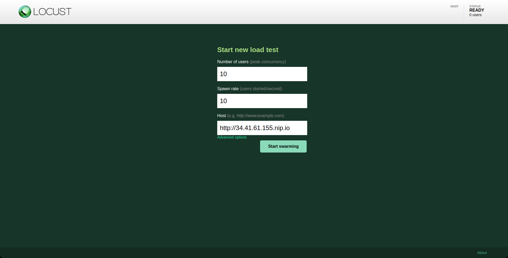
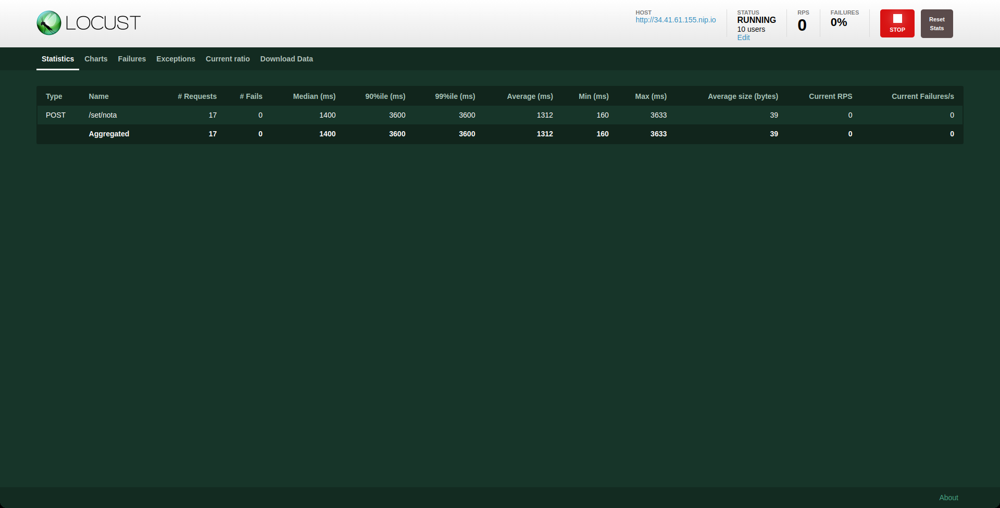
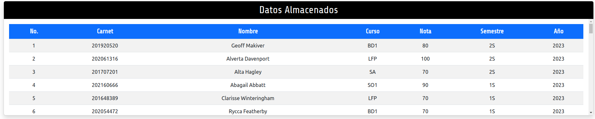
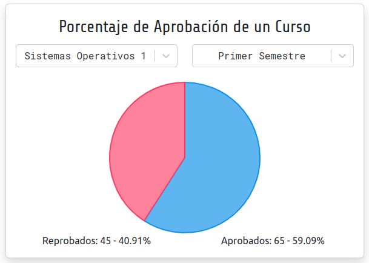
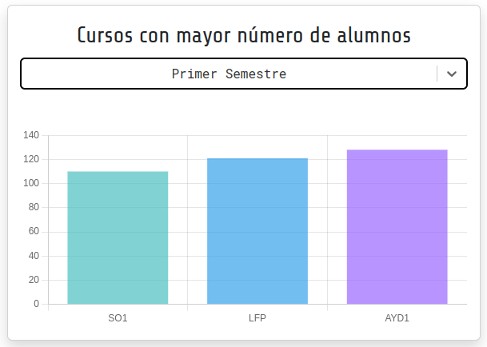
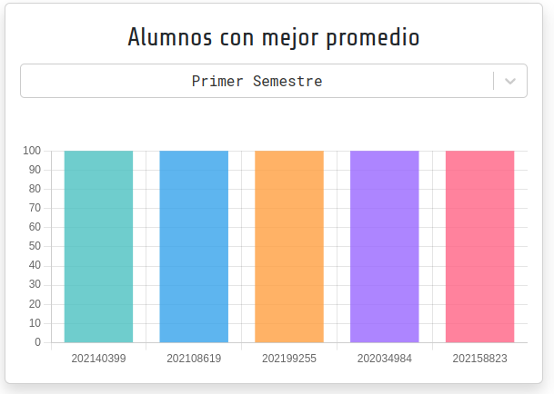
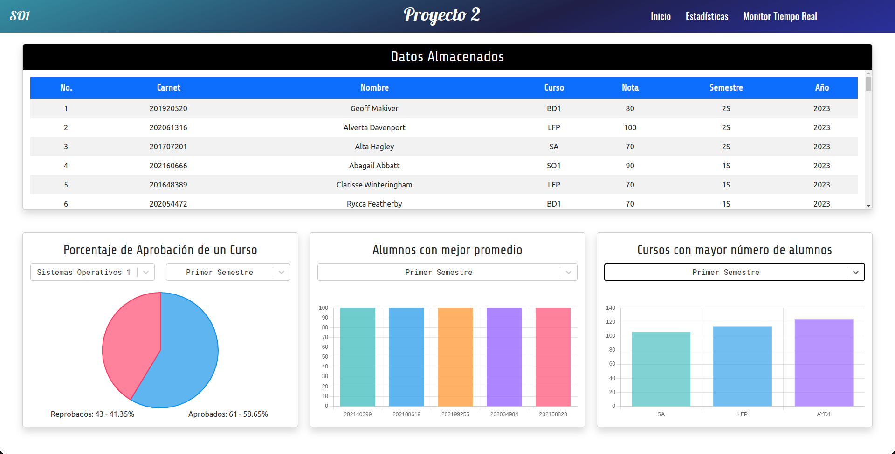
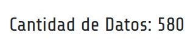
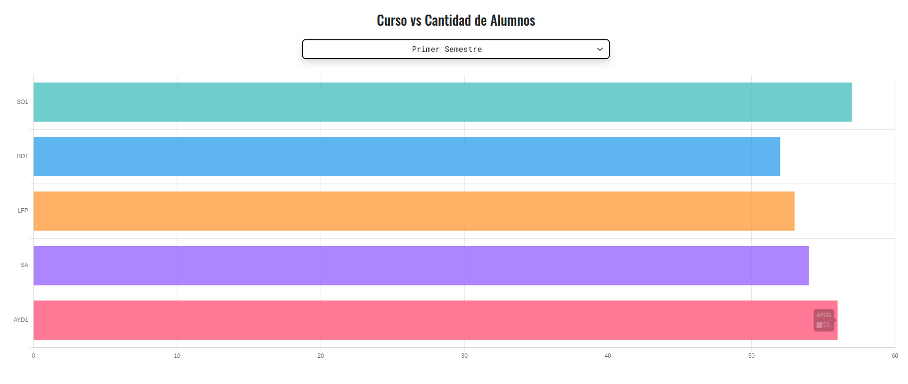
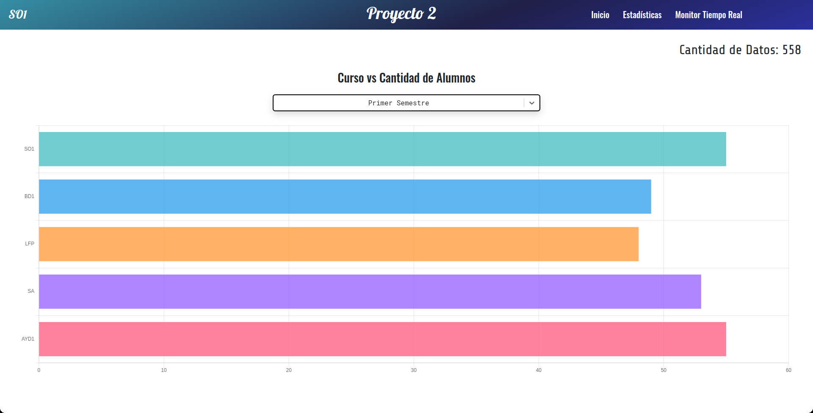

# 📑 MANUAL TÉCNICO [SO1]P2_201901772

```bash
Universidad de San Carlos de Guatemala
Facultad de Ingeniería
Escuela de Ciencias y Sistemas
Laboratorio Sistemas de Bases de Datos 1
Ing. Jesus Guzman Polanco
Aux. José DANIEL Velásquez Orozco
Aux. Jhonathan Daniel Tocay

Carné: 201901772
Nombre: Daniel Reginaldo Dubón Rodríguez
```
# Sistema de Registro de Notas

El objetivo de este proyecto es evaluar y mejorar el rendimiento de un sistema de ingreso de
notas en línea mediante pruebas de carga y rendimiento utilizando Locust, Kubernetes y
servicios en la nube como Cloud SQL y Cloud run. El sistema permite a los profesores o
administradores académicos ingresar y gestionar las calificaciones de los estudiantes de
manera eficiente. Además se debe de implementar una Aplicación web donde se muestre
las estadísticas y reportes de las notas de los estudiantes.

## Generador de tráfico Locust

<div align="center"></div>

***Tecnologías Utilizadas:*** Lenguaje de Programación Python, Locust

Esta herramienta permite simular el tráfico de usuarios en el sistema de registro de notas, para esto se usa el lenguaje de programación Python y la librería Locust, la cual permite la simulación de tráfico de usuarios en el sistema de registro de notas.

Para poder utilizar este se debe tener instalado una versión de Python 3.8 o superior y el gestor de paquetes de Python llamado pip.

Para poder instalar todas las dependencias del proyecto se debe de ejecutar el siguiente comando:

```bash
pip install -r requirements.txt
```
La aplicación se encuentra en el siguiente directorio: [`Generador de tráfico`](../locust)

Para poder ejecutar el generador de trafico se debe de ejecutar el siguiente comando:

```bash
locust -f traffic.py
```

El formato de los datos que se envian al sistema de registro de notas es el siguiente:

```json
{
    "carnet": 201901772,
    "nombre": "Daniel Reginaldo Dubon Rodriguez",
    "curso": "SO1",
    "nota": 100,
    "semestre": "2S",
    "year": 2023
}
```

Los Cursos a Monitorear pueden ser:

- **SO1** - Sistemas Operativos 1
- **BD1** - Sistemas de Bases de Datos 1
- **LFP** - Lenguajes Formales y de Programación
- **SA** - Software Avanzado● AYD1 - Análisis y Diseño 1

La descripción para semestre puede se:
- **1S** - Primer Semestre.
- **2S** - Segundo Semestre.
**Año**: 2023
**Nota**: 50, 60, 70, 80, 90, 100.

El endopoint para el envio de datos es el siguiente:

| EndPoint | Método HTTP | Descripción |
| ------ | :------: | ------ |
| `/set/nota` | `POST` | Envia los datos de la nota de un estudiante |

Luego de haber ejecutado el comando para ejecutar el generador de trafico se debe de abrir el navegador y acceder a la siguiente dirección: [`http://localhost:8089/`](http://localhost:8089/)

<div align="center"></div>

En esta se ingresa la siguiente información:

- **Number of total users to simulate**: Cantidad de usuarios a simular.

- **Spawn rate (users spawned/second)**: Cantidad de usuarios a simular por segundo.

- **Host**: Dirección del sistema de registro de notas.

Luego de haber ingresado la información se debe de dar click en el botón **Start swarming**.

<div align="center"></div>

En esta se puede observar la cantidad de usuarios que se estan simulando y la cantidad de peticiones que se estan realizando por segundo.

## Aplicación Web

***Tecnologías Utilizadas:*** React, NodeJS, Express, Socket.io, Chart.js

Esta aplicación web se encarga de mostrar las estadisticas de las notas de los estudiantes en tiempo real y estático. Esta aplicación se encuentra en el siguiente link: [`Aplicación Web`](https://frontend-notas-jvkv27pera-ue.a.run.app)

Esta Aplicación Web posee dos vistas:

- ### Parte Estática
  
  Este dashboard consume los datos de la API NODE para poder mostrar las estadisticas de las notas de los estudiantes.

  Posee los siguientes reportes:

  - **Datos Almacenados**: Muestra los datos almacenados en la base de datos Cloud SQL.

    <div align="center"></div>


  - **Gráfica Circular de las Notas de un Curso en un semestre. (No. Aprobados y
Reprobados)**: Muestra el porcentaje de aprobados y reprobados de un curso en un semestre específico.

    <div align="center"></div>

  - **Gráfica de Barras de Cursos con Mayor número de alumnos en un semestre específico. (Mostrar Top 3)**: Muestra los cursos con mayor número de alumnos en un semestre específico.

    <div align="center"></div>

  - **Gráfica de Barras de Alumnos con mejor Promedio (Mostrar únicamente un Top 5)**: Muestra los alumnos con mejor promedio.

    <div align="center"></div>

    Vista general de la parte estática:

<div align="center"></div>

- ### Parte tiempo real

    Este dashboard consume el servicio de NodeJS a través de sockets para poder mostrar las estadisticas de las notas de los estudiantes en tiempo real. Esta parte consume los datos de la base de datos de REDIS.

    Posee las siguientes reportes:

    - **Cantidad Total de Registros en Tiempo Real**: Muestra la cantidad total de registros en tiempo real almacenados en la base de datos de REDIS.

    <div align="center"></div>

    - **Cantidad de Alumnos en un Curso y Semestre Específico**: Muestra la cantidad de alumnos en un curso y semestre específico en tiempo real.

    <div align="center"></div>

    Vista general de la parte tiempo real:

<div align="center"></div>

## Comandos básicos de Kubernetes

Estos comandos se utilizan para poder administrar el cluster de Kubernetes, como por ejemplo, crear namespaces, pods, deployments, servicios, HPA, etc. Se debe de tener instalado el cliente de Kubernetes que se puede descargar en el siguiente link: [`kubectl`](https://kubernetes.io/es/docs/tasks/tools/install-kubectl/)

  - **Obtener los pods**

      ```bash
      kubectl get pods -n <nombre_namespace>
      ```

  - **Obtener los servicios**

      ```bash
      kubectl get services -n <nombre_namespace>
      ```

  - **Obtener los deployments**

      ```bash
      kubectl get deployments -n <nombre_namespace>
      ```

  - **Obtener los HPA**

      ```bash
      kubectl get hpa -n <nombre_namespace>
      ```

  - **Obtener los ingress**

      ```bash
      kubectl get ingress -n <nombre_namespace>
      ```

  - **Obtener los namespaces**

      ```bash
      kubectl get namespaces
      ```

  - **Obtener los logs de un pod**

      ```bash
      kubectl logs <nombre_pod> -n <nombre_namespace>
      ```

  - **Obtener los eventos del cluster**

      ```bash
      kubectl get events -n <nombre_namespace>
      ```

  - **Obtener los recursos del cluster**

      ```bash
      kubectl top nodes -n <nombre_namespace>
      ```

  - **Obtener los recursos de un pod**

      ```bash
      kubectl top pods -n <nombre_namespace>
      ```

  - **Obtener los recursos de un deployment**

      ```bash
      kubectl top deployments -n <nombre_namespace>
      ```

  - **Obtener los recursos de un HPA**

      ```bash
      kubectl top hpa -n <nombre_namespace>
      ```

  - **Obtener los recursos de un servicio**

      ```bash
      kubectl top services -n <nombre_namespace>
      ```

  - **Obtener los recursos de un ingress**

      ```bash
      kubectl top ingress -n <nombre_namespace>
      ```