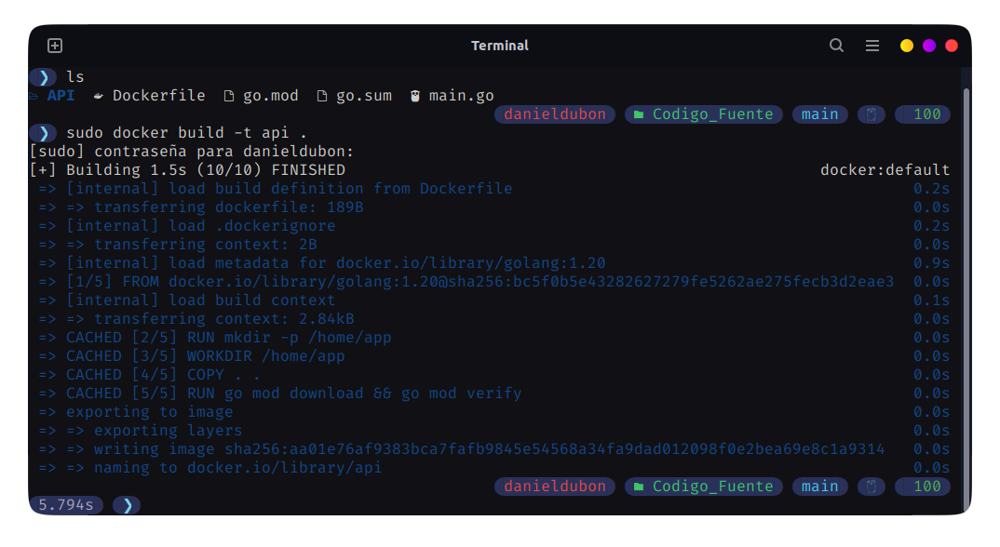
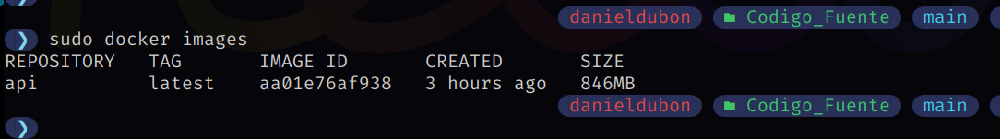
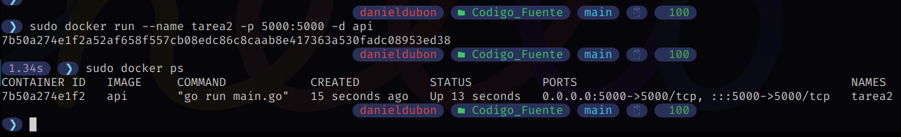
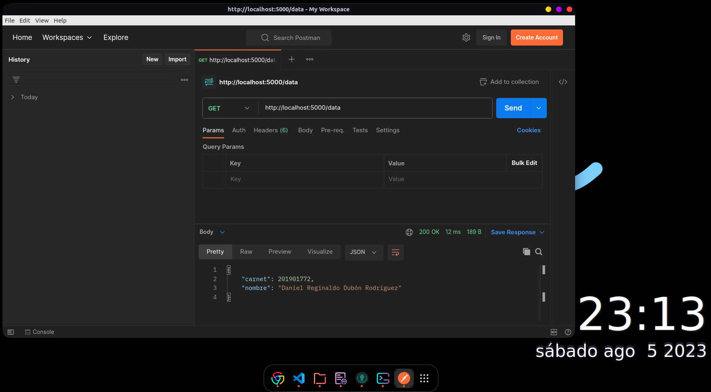
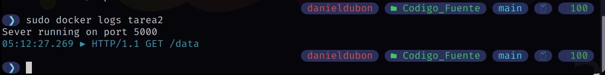

***201901772 - Daniel Reginaldo Dubón Rodríguez***

# 👨‍💻 Tarea 2

## Descripción

Crear un script de Bash que realice Io siguiente:

Realizar una API utilizando el lenguaje de programación Go que contenga el
endpoint "/data". Este endpoint estará diseñado para retornar los datos de un
estudiante, incluyendo su número de carnet y nombre en formato JSON. La API
será dockerizada para facilitar su despliegue. Además, se utilizará Postman para
consumir el endpoint y verificar que los datos se obtienen correctamente.

## ✅ Código Fuente

- [`Código API en GO`](./Codigo_Fuente)
- [`Dockerfile`](./Codigo_Fuente/Dockerfile)

## ✅ Capturas de pantalla

### Creación de la imagen

### Imagen creada

### Creación y ejecución del contendor

### Prueba de la API con Postman

### Logs de la API dentro del contenedor

